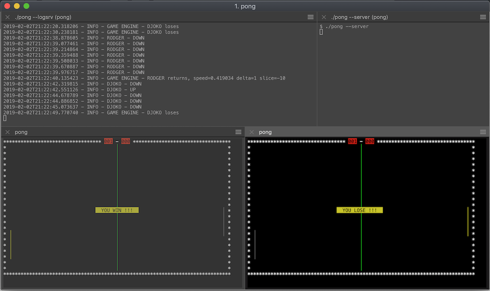

# Coding Dojo 2

## GitHub

[thales6](https://github.com/thales6)

## ncurses

* [Homepage](https://invisible-island.net/ncurses/)
* [HOWTO](http://tldp.org/HOWTO/NCURSES-Programming-HOWTO/)
* [HOWTO Python3](https://docs.python.org/3/howto/curses.html)

## ZeroMQ

* [Web site](http://zeromq.org/)
* [source code](https://github.com/zeromq/libzmq)
* [API](http://api.zeromq.org)
* [zguide](http://zguide.zeromq.org/) [explanations](http://zguide.zeromq.org/page:all#Sending-and-Receiving-Messages)
* [examples](https://github.com/booksbyus/zguide)
* [pyzmq](https://learning-0mq-with-pyzmq.readthedocs.io/)
* [cppzmq](https://github.com/zeromq/cppzmq)


## ØMQ

````
zeromq = sockets simplifiées
       ~ message-oriented middleware
       != API de haut niveau
       != broker
       != corba, ice, amqp, mqtt, rpc, ...
````

* développé en mode collectif sur GitHub
* léger
* rapide
* disponible partout et pour tous les langages
* adaptable à tous les besoins (ou presque!)


## Dojo

### log : [PUSH/PULL](http://api.zeromq.org/4-2:zmq-socket#toc15)

* producteurs de traces: PUSH
* consommateur de traces: PULL
* transport: ipc, tcp
* avantages / inconvénients ?

* Autre possibilité: [PUB/SUB](http://api.zeromq.org/4-2:zmq-socket#toc10)
* Autre possibilité (DRAFT API): [RADIO/DISH](http://api.zeromq.org/4-2:zmq-socket#toc6)

### jeu

* Serveur -> Joueurs : PUB/SUB
* Joueur -> Serveur : PUSH/PULL
* Autre possibilité : [DEALER/ROUTER](http://api.zeromq.org/4-2:zmq-socket#toc24)


## Résultat


